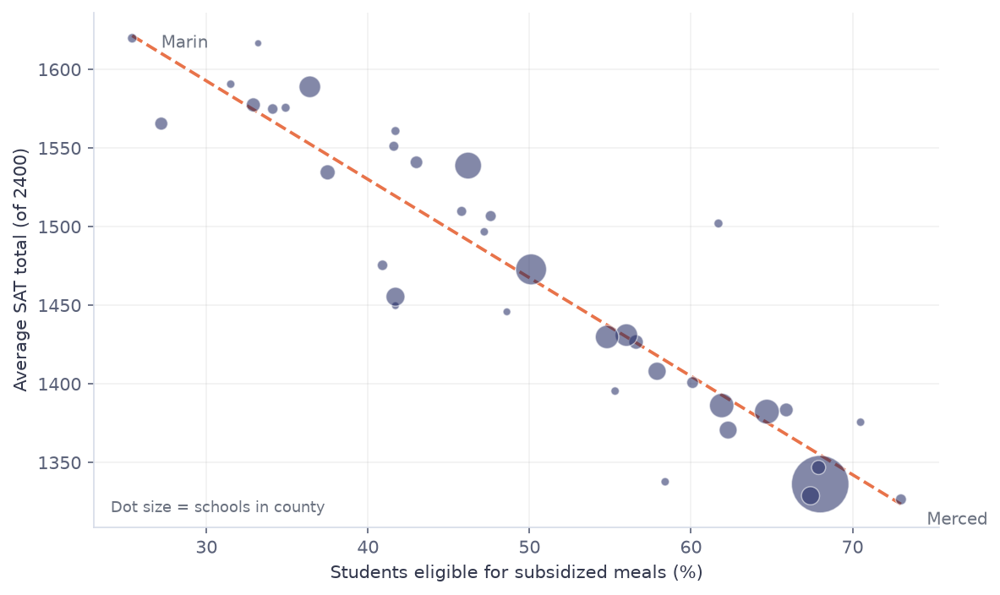
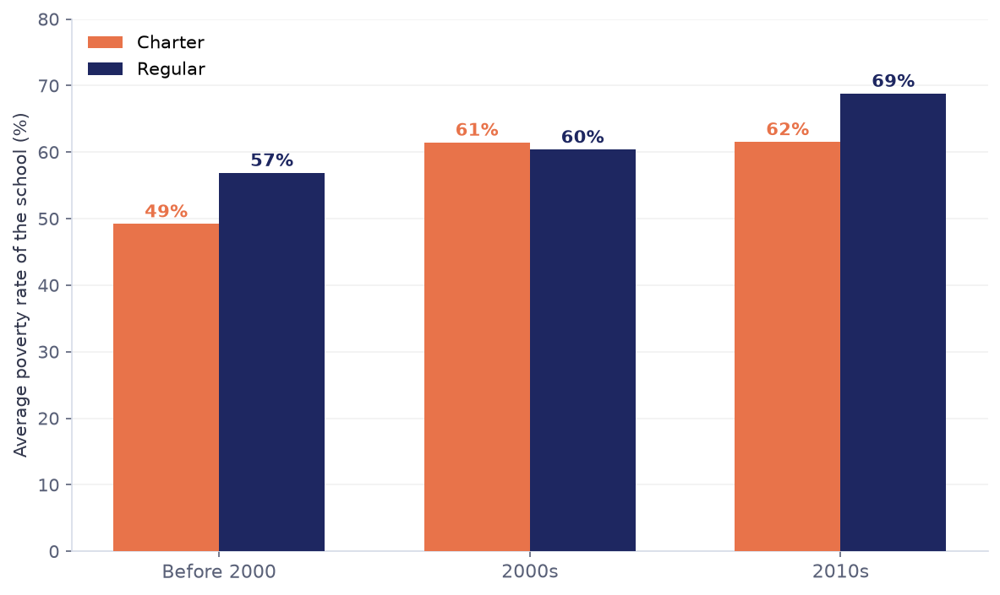
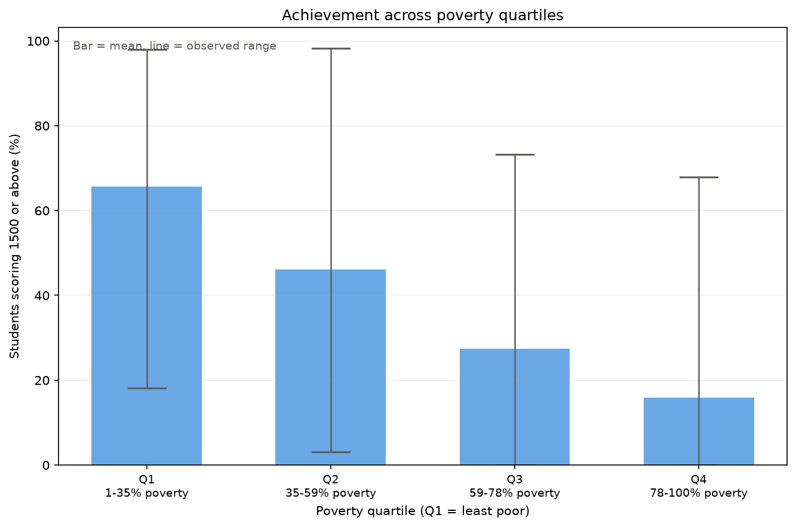
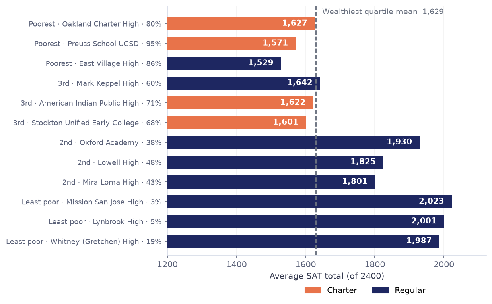

# California School SAT Performance and Poverty

A data pipeline that examines how school poverty relates to SAT performance
across California, and which schools depart from that pattern.

---

## Problem

School funding debates often assume poverty determines outcomes. This project
tests that assumption against California's own records and asks a follow-up
question the assumption cannot answer: which schools do well anyway?

Four questions:

1. **Aggregation.** How do county poverty levels and average SAT scores compare?
2. **Time trend.** Has the poverty level of areas where new schools open changed?
3. **Distribution.** How is achievement spread within each poverty quartile?
4. **Comparison.** Which schools perform best among peers facing similar need?

Each question is answered by one SQL query and one chart.

---

## Data

**Source:** [SQLite data starter packs, padjo.org](http://2016.padjo.org/tutorials/sqlite-data-starterpacks/),
compiled from California Department of Education records. The database is
committed to this repository so the pipeline runs after a plain clone.

### Tables

| Table | Rows | Contents |
|---|---|---|
| `schools` | 17,686 | School directory: address, opening date, charter status, coordinates |
| `frpm` | 10,395 | Free and reduced-price meal eligibility for 2014-15, used as the poverty measure |
| `satscores` | 2,331 | SAT section averages, test taker counts, share scoring 1500 or above |

### Join key

`schools.CDSCode` is a 14-character string: two digits of county, five of
district, seven of school. `satscores.cds` uses the same format. `frpm` splits
it across three columns, and stores `District Code` as an INTEGER, so the key
has to be reassembled:

```sql
f."County Code" || printf('%05d', f."District Code") || f."School Code"
```

The zero padding is defensive. Every district code in the current data is
already five digits, so the join works without it, but a four-digit code in a
future release would silently break the match.

### Cleaning

| Step | Rows affected | Reason |
|---|---|---|
| Keep `rtype = 'S'` | 533 removed | `satscores` mixes state, county, district, and school aggregates in one table. Averaging without this filter counts the same students at several levels. |
| Drop missing SAT scores | 499 removed | Not random. Every school with a score had 11 or more test takers; every school without one had 10 or fewer. This is CDE's privacy suppression rule. |
| Convert `frpm_rate` to a percentage | all rows | The column is named `Percent (%) Eligible FRPM` but holds proportions such as 0.66. `PctGE1500` is already a percentage, so the two were on different scales. |
| Treat `1980-07-01` as missing | 10,679 dates | 65% of all opening dates fall on this single day. It is the date CDE's electronic system went live, not a real opening date. |

**Final samples:**

- SAT analysis (Q1, Q3, Q4): **1,251 schools across 56 counties**
- Opening-era analysis (Q2): **3,701 schools**, larger because SAT scores are not required

**Known limitations:**

- Schools with fewer than 11 SAT takers are absent entirely, so small and rural
  schools are underrepresented.
- Four schools with SAT scores have no matching FRPM record and were dropped.
- All relationships reported here are correlations. The data cannot separate
  poverty from the other things that travel with it.

---

## Structure

```
ca-schools-pipeline/
├── data/cdeschools.sqlite     source database, read only
├── pipeline/
│   ├── load.py                SQL queries, returns raw DataFrames
│   ├── clean.py               filtering and unit fixes, one comment per transform
│   ├── analyze.py             one function per question, returns a DataFrame
│   └── visualize.py           one function per chart, returns a Figure
├── tests/                     unit tests for load and clean
├── outputs/                   generated CSVs and charts
├── main.py                    runs the pipeline end to end
└── .github/workflows/ci.yml   installs dependencies and runs pytest on every push
```

The split is deliberate: `load` fetches, `clean` judges, `analyze` returns,
`visualize` draws. Because `load` removes no rows, the raw and cleaned frames
can be compared directly, which is how the row counts in the table above were
verified. Because `clean` takes and returns a DataFrame, it can be tested
against hand-built frames without touching the database.

`analyze` runs SQL rather than pandas so the required techniques stay visible:
a three-table join for Q1, `strftime` for Q2, a CTE with `NTILE` for Q3, and
`RANK` with `PARTITION BY` for Q4. All user-supplied values are bound with `?`
placeholders.

**Run it:**

```bash
python -m venv .venv && source .venv/bin/activate
pip install -r requirements.txt
python main.py
pytest -v
```

---

## Findings

### Q1: County poverty tracks SAT performance closely



Correlation across 38 counties with five or more schools: **−0.918**.

| County | Poverty | SAT total |
|---|---|---|
| Merced | 73.0% | 1,327 |
| Los Angeles | 68.0% | 1,336 |
| Placer | 27.2% | 1,566 |
| Marin | 25.4% | 1,620 |

Counties with fewer than five schools are excluded; their averages rest on too
few schools to be stable. Dot size in the chart shows how many schools each
county contributes.

### Q2: New schools increasingly open in poorer areas, and charters reversed direction



| Era | Charter poverty | Regular poverty |
|---|---|---|
| Before 2000 | 49.2% | 56.9% |
| 2000s | 61.5% | 60.4% |
| 2010s | 61.5% | 68.8% |

Early charter schools opened in **less** poor areas than the regular schools of
the same period, not more. The gap closed during the 2000s, and by the 2010s
new regular schools were serving the poorer communities. The common framing of
charters as a high-poverty intervention fits the later period, not the origin.

### Q3: The averages separate, but the distributions overlap



| Quartile | Poverty range | Mean scoring 1500+ | Observed range |
|---|---|---|---|
| Q1 (least poor) | 0.8 – 34.7% | 65.6% | 18.2 – 98.1% |
| Q2 | 34.7 – 58.7% | 46.1% | 3.1 – 98.2% |
| Q3 | 58.9 – 77.9% | 27.4% | 0.0 – 73.3% |
| Q4 (poorest) | 77.9 – 100% | 15.9% | 0.0 – 67.9% |

The means fall cleanly, but the ranges do not separate. The weakest school in
the wealthiest quartile (18.2%) sits below the strongest school in the poorest
quartile (67.9%). Poverty predicts the average and leaves the individual case
open. This is the finding a chart of means alone would have hidden.

### Q4: Once poverty is held roughly constant, the exceptions are real



| Quartile | School | Poverty | SAT total | Above quartile mean | Charter |
|---|---|---|---|---|---|
| Q1 | Mission San Jose High | 3% | 2,023 | +394 | |
| Q2 | Oxford Academy | 38% | 1,930 | +450 | |
| Q3 | American Indian Public High | 71% | 1,622 | +277 | yes |
| Q4 | Oakland Charter High | 80% | 1,627 | +376 | yes |
| Q4 | Preuss School UCSD | 95% | 1,571 | +320 | yes |

Oakland Charter High serves a student body that is 80% eligible for subsidized
meals and averages 1,627, within three points of the mean for the **wealthiest**
quartile (1,629). Preuss School UCSD does it at 95% poverty. These are the
concrete cases behind the overlap in Q3.

Charter schools cluster in the exceptions as poverty rises: none of the top
performers in Q1 or Q2, three of four in Q3, and two of four in Q4. That
connects back to Q2, where charters moved into higher-poverty areas over time.

---

## Challenges

### A single day held 65% of the opening dates

**Symptom.** Grouping schools by opening year put 10,681 schools in 1980, more
than every other year combined.

**Investigation.** Breaking 1980 down by exact date showed 10,679 of them on
`1980-07-01`. The schools sharing that date were a mixed bag with no plausible
common opening: adult schools, juvenile hall programs, and long-defunct high
schools. July 1 is the start of California's fiscal year.

**Conclusion.** It is the date CDE's electronic records began, applied to every
school that already existed. `clean.py` converts it to `NaT` rather than
deleting the rows, so it is handled as the missing value it is.

**What this taught.** Counting nulls is not enough. A missing value disguised
as a valid one only shows up in a frequency distribution.

### The first version of Q4 measured the wrong thing

**Symptom.** Ranking schools against their county average produced a top ten
whose poverty rates were 1% to 19%, in counties averaging 68%.

**Investigation.** The metric was working exactly as written. Wealthy schools
inside poor counties have the largest gap from the county mean, so the query
was surfacing within-county inequality rather than schools beating their
circumstances.

**Fix.** Partition by poverty quartile instead of by county, so each school is
compared against others facing similar need. The window function requirement is
unchanged; the comparison group is what moved.

**What this taught.** A query can be correct and still answer the wrong
question. The check is whether the output matches what the question meant.

### CI failed on a pipeline that ran locally

**Symptom.** All tests passed locally, but GitHub Actions failed at the install
step with `No matching distribution found for numpy==2.5.1`.

**Investigation.** `requirements.txt` had been generated with `pip freeze`,
which pinned the exact versions installed on macOS under Python 3.13. numpy
2.5.1 requires Python 3.12 or newer, and the workflow specified 3.11.

**Fix.** List only the direct dependencies without version pins, and set the
workflow to the same Python version used locally.

**What this taught.** `pip freeze` records an environment, it does not describe
a project. CI catches the "works on my machine" gap precisely because it starts
from nothing.

### The unit mismatch that would have been invisible

`frpm` stores values like `0.66` in a column named `Percent (%) Eligible FRPM`,
while `PctGE1500` holds `52.94`. Both would plot without error and both axes
would be labeled percent. It was caught by checking the observed range of every
numeric column before using it, not by anything failing.

---

## Sources

- [SQLite data starter packs, padjo.org](http://2016.padjo.org/tutorials/sqlite-data-starterpacks/)
- [SAT Data Report, California Department of Education](https://www.cde.ca.gov/re/pr/satdata.asp)
